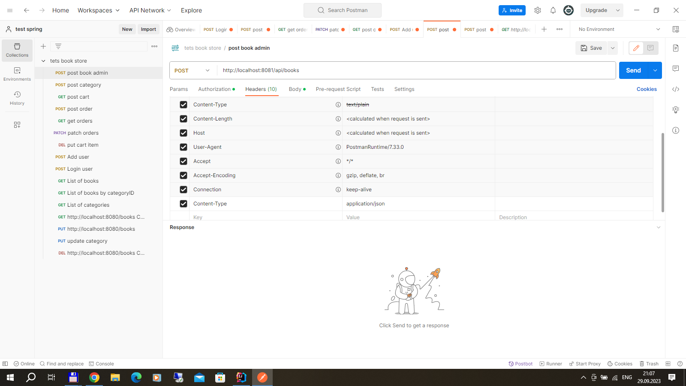
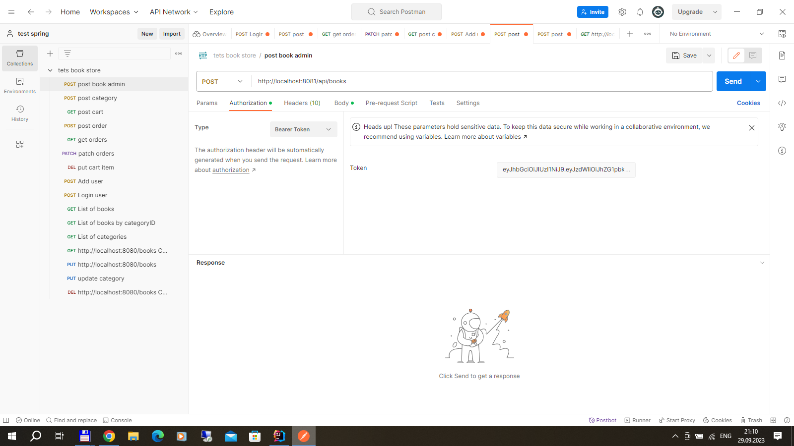
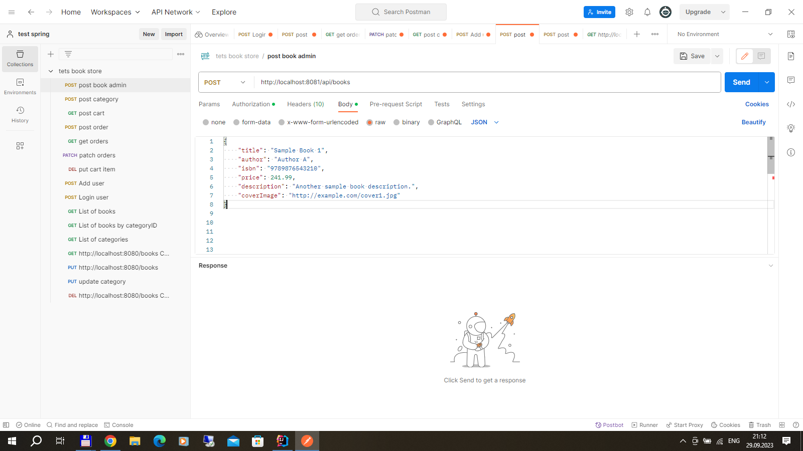

# Book store api
## Description
Book store it's a service which allows register customers and bye books. This API supports
authentication, registration, CRUD (Create, Read, Update,Delete) operations with entity of database.

## Features:
- registration user with role "USER";
- authentication user;
- create/get list of books;
- create/get categories of books;
- add books to a shopping cart;
- edit a shopping cart;
- checkout an order for an authenticated user;
- complete an order and get list of orders for an authenticated user;
- under role ADMIN can edit statuses of an order

## Technologies Used
- Spring boot framework 3.1.3
- jackson web token 0.11.5
- Java 17
- Maven 3.1.1
- Mapstruct 0.2.0
- Test containers 1.18.0 
- Lombok 0.2.0
- MySQL 8.0.28
- Docker 3.1.3
- Liquibase 4.20.0

# Endpoints available for used api  
## Available for non authenticated users:
- POST: /api/auth/register
- POST: /api/auth/login
## Available for users with role USER
- GET: /api/books
- GET: /api/books/{id}
- GET: /api/categories
- GET: /api/categories/{id}
- GET: /api/categories/{id}/books
- GET: /api/cart
- POST: /api/cart
- PUT: /api/cart/cart-items/{cartItemId}
- DELETE: /api/cart/cart-items/{cartItemId}
- GET: /api/orders
- POST: /api/orders
- GET: /api/orders/{orderId}/items
- GET: /api/orders/{orderId}/items/{itemId}
## Available for users with role ADMIN
- POST: /api/books/
- PUT: /api/books/{id}
- DELETE: /api/books/{id}
- POST: /api/categories
- PUT: /api/categories/{id}
- DELETE: /api/categories/{id}
- PATCH: /api/orders/{id}

# Note on use the api
Please note that when using the api endpoints with methods POST, PUT, PATCH required JSON body. Security builds on
technology jackson web token (JWT) with using Bearer token. 

# Instructions:
- To run the book store API on a server, you will need to first run Docker.
- After running api database in first time will create all necessary tables in database
- To register an Administrator in the system, you will need to use the endpoint "POST: /api/auth/register" just like a usual user. 
 Once the Administrator user is registered, you can add a record in the table user_roles with the following query: 
"INSERT INTO user_roles (user_id, role_id) values(ID_Administrator, 2);" where "ID_Administrator" is the ID of the Administrator from the table "users". This will assign the "ADMIN" role to the newly registered user.
- All credentials for connect to database you can set in file ".env"

# Below is an example of how you can add a book
- set a headers

- set a token

- set a body and press send
